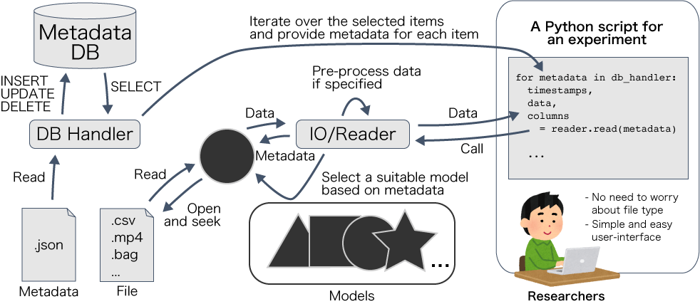

.. Dataware Toolkit documentation master file, created by
   sphinx-quickstart on Tue May 26 07:48:30 2020.
   You can adapt this file completely to your liking, but it should at least
   contain the root `toctree` directive.

Welcome to Dataware Toolkit's documentation!
===========================================

Pydtk is a toolkit for managing, retrieving, and processing data.

Concepts
========
Pydtk are composed of three main components:

- DB handlers that manage the meta-information of data
- Models for reading/writing files of the right type
- IO function to select appropriate models based on meta-information and to read/write data

The relationship between the components are described in the following figure.

Installation
============
You can install the toolkit with the following command:

.. code-block:: bash

   $ poetry add git+https://github.com/dataware-tools/pydtk.git

Make sure that `poetry <https://python-poetry.org/>`_ is installed before executing the command.

If you want to install the toolkit with extra feature (e.g. support for mysql DB),
please specify it with `-E` option.
Example (installation with `mysql` and `ros` extras):

.. code-block:: bash

   $ poetry add git+https://github.com/dataware-tools/pydtk.git -E mysql -E ros

.. toctree::
   :maxdepth: 2
   :caption: Quick start:
   :numbered:
   :glob:

   ./quickstart/*

.. toctree::
   :maxdepth: 2
   :caption: API References:

   modules/modules

Indices and tables
==================

* :ref:`genindex`
* :ref:`modindex`
* :ref:`search`
